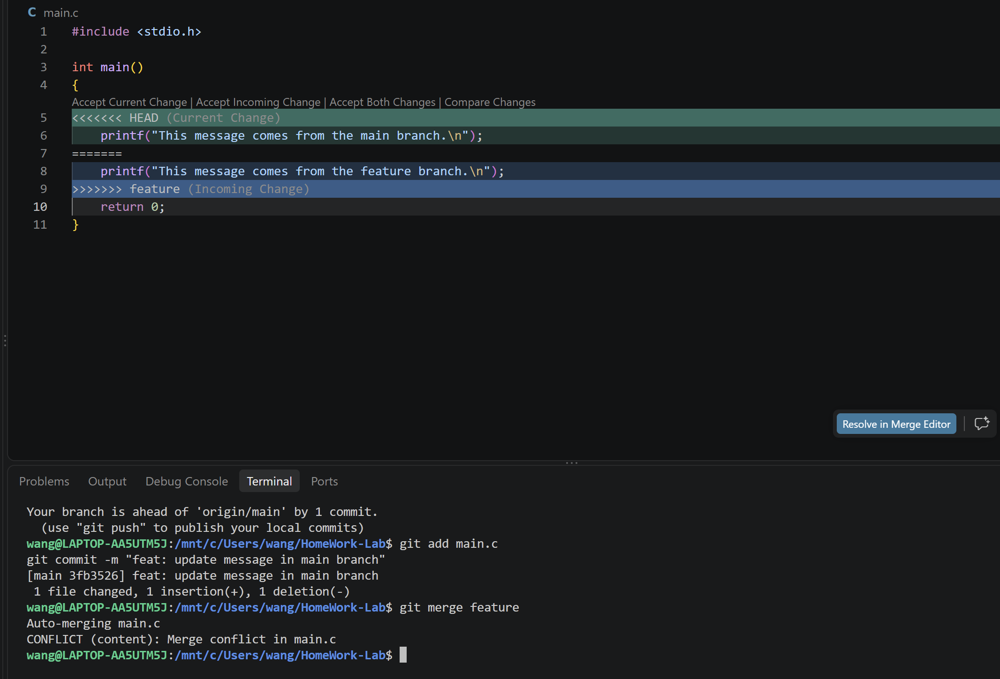

# 实验报告

## 一、Git 基础问题

### 1. 你之前有过多人协同开发的经历吗？如果有，你们是使用什么方式分工协作的？

我在两个月以前有过多人协同开发的经历。在参加数学建模国赛的时候，我的两个队友提议用Git管理每个人的修改，当时我们主要是同时维护不同的模块并push到Github上，便于同步信息。

### 2. 思考一下，Git 为什么要设计“暂存-提交”两个步骤？

暂存区可以让用户梳理修改，选择哪些修改要放入下一次提交。提交则内容保存为一个清晰的，可回溯的版本。这样可以便于查看和恢复成历史版本。

### 3. git branch 和 git branch -a 的区别是什么？

git branch 默认只显示本地分支。git branch -a 会同时显示本地分支和远程跟踪分支。

## 二、个人仓库、修改main与commit

已完成

## 三、阅读网页总结

### 1. Commit Message 规范

Git提交说明很重要，要表达修改目的，可以依照提交类型，影响范围和简短主题进行组织。（例子：feat(login): add password validation。）提交说明有助于提高团队协作效率，也便于后续维护、排查和版本发布。

### 2. 语义化版本

软件版本号应传达本次修改带来的影响。语义化版本能反映出软件接口是否发生变化、是否增加了新的功能，以及是否修复了已有问题等信息。

语义化版本由主版本号、次版本号和修订号组成。主版本号反映不兼容修改，次版本号反映保持向下兼容的功能增加，修订好反映保持兼容的问题修正。这样的版本规范利于管理。

### 3.对Git学习的理解

Git可以保存不同的版本，允许多开发者独立地开发不同分支的不同内容，便于多人协作。

## 四、分支与合并冲突

本次实验在 `main` 和 `feature` 两个分支中修改了 `main.c` 的同一行。执行合并操作后，Git 无法自动判断应该保留哪个版本，因此产生了合并冲突。

我在 VS Code 中查看了冲突区域，区分了当前分支内容和被合并分支内容，选择保留正确的代码，并删除了冲突标记。之后重新暂存文件并提交，完成了冲突解决。

下面是合并冲突发生时的截图:

